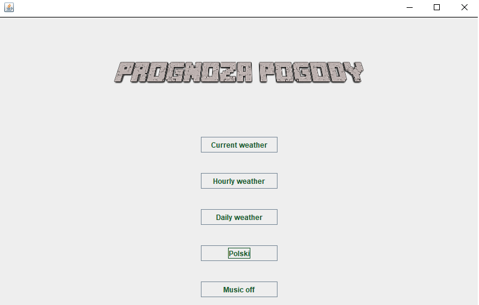
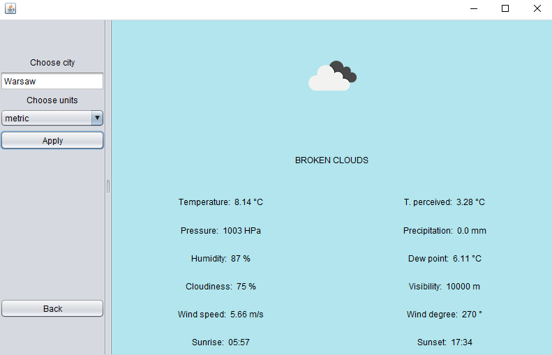
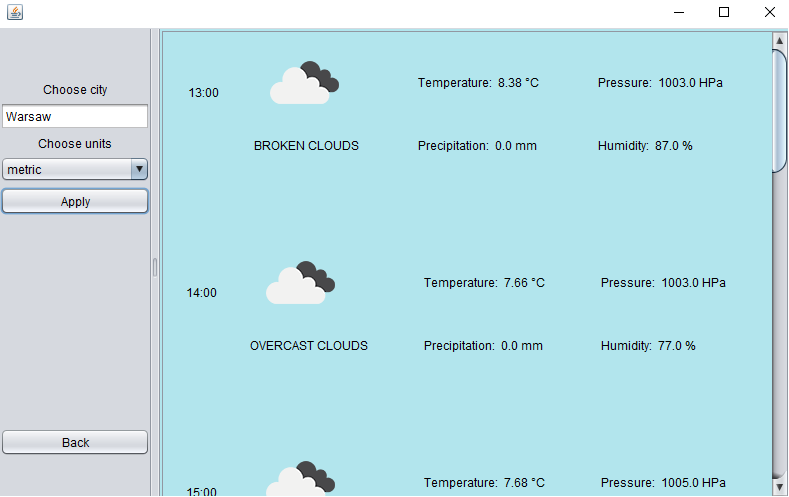
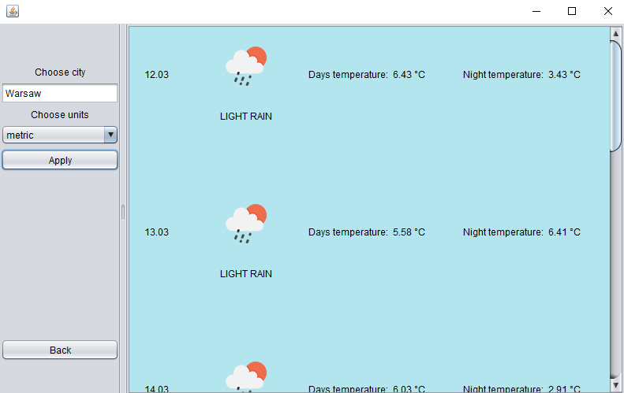

# Weather app

Project made for Advanced Object-Oriented and Functional Programming course by Maciej Gryszkiewicz, Miłosz Mazur and Maciej Chylak .

In the main menu user can choose one of the three options of weather prediction: current, hourly and daily. User is also able to change language of the app to English or Polish. 

After choosing appropriate display option, user needs to insert a city name and choose a preferred metric system. Adequate predictions are shown on the right panel.

